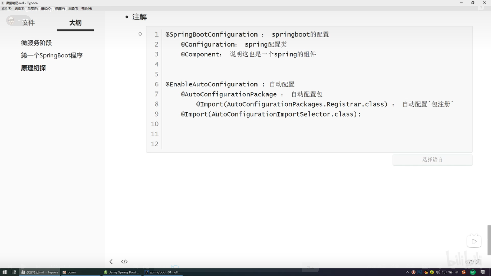
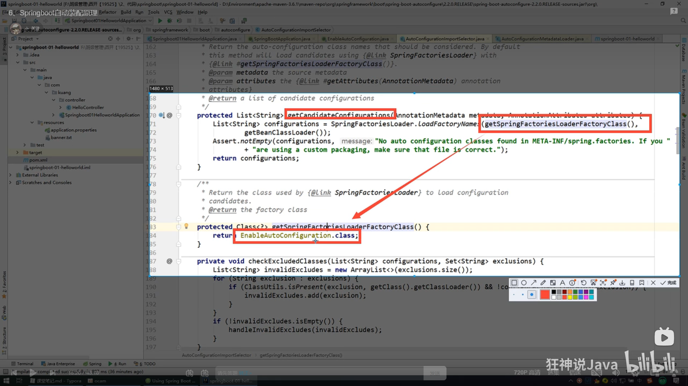
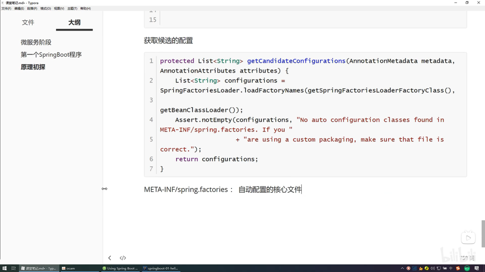
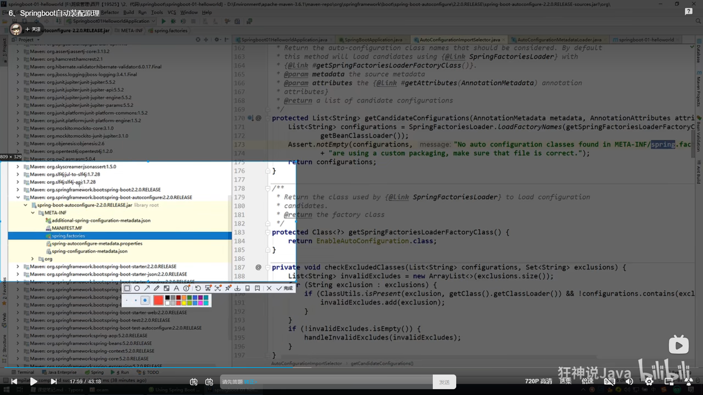

## SrpingBoot

## key:自動裝配


## 微服務階段

## 第一個SpringBoot程序

## 原理初探

自動配置：

pom.xml
- spring-boot-dependencies : 核心依賴在副工程中
- 我們在寫或者引入一些SpringBoot依賴的時候，不需要指定版本，就因為有這些版本倉庫

啟動器
```xml
		<dependency>
			<groupId>org.springframework.boot</groupId>
			<artifactId>spring-boot-starter-web</artifactId>
		</dependency>
```
- 啟動器：說白了就是Spring的使用場景
- 比如spring-boot-start-web，他就會幫我們自動導入web環境所有的依賴
- springboot會將所有的功能場景，都變成一個個的啟動器
- 我們要使用什麼功能，就只需要找到對應的啟動器就可以了 `starter`


主程序

```java
//@SpringBootApplication: 標註這個類是一個springboot的應用
@SpringBootApplication
public class DemoApplication {

	public static void main(String[] args) {
		//將springboot應用啟動
		SpringApplication.run(DemoApplication.class, args);
	}

}
```
- 註解
```java
@SpringBootConfiguration //springboot的配置


@EnableAutoConfiguration
```







