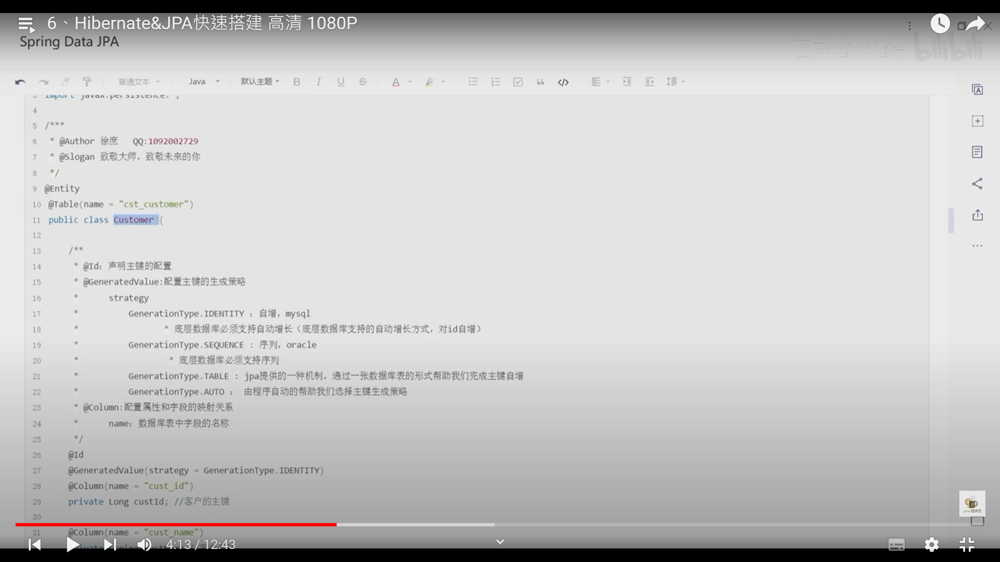
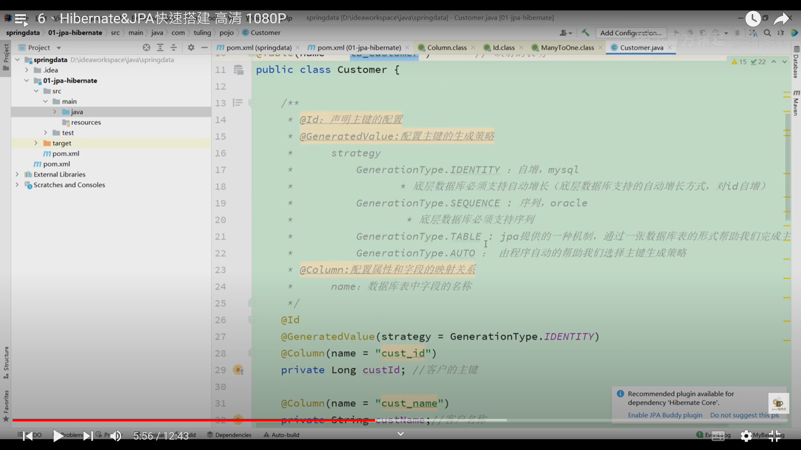
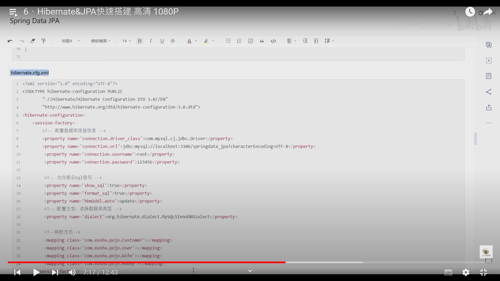
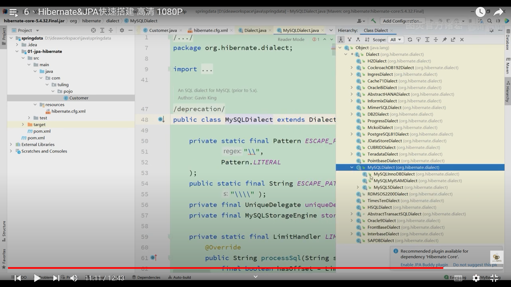
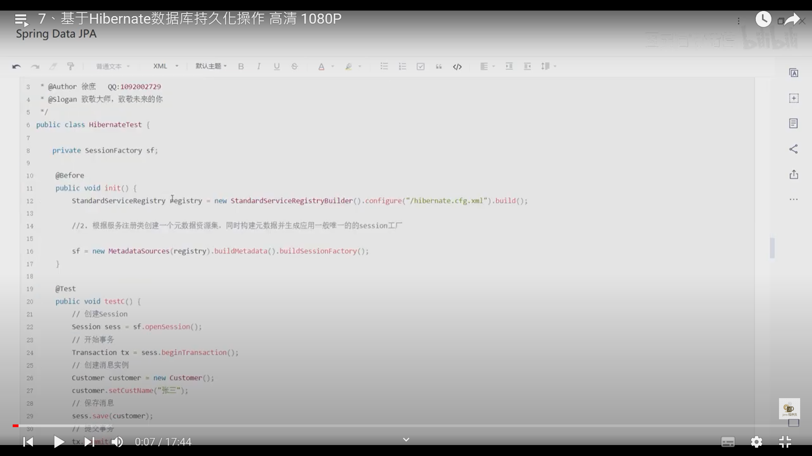
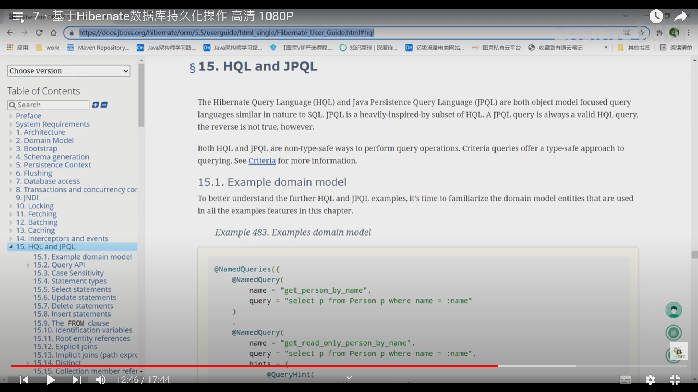
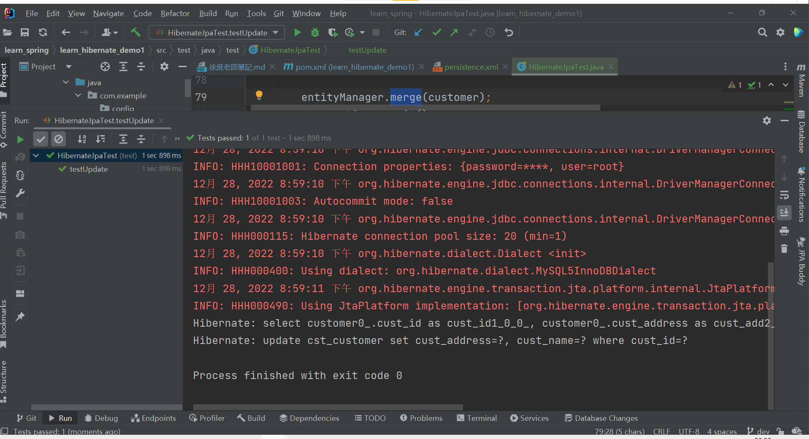
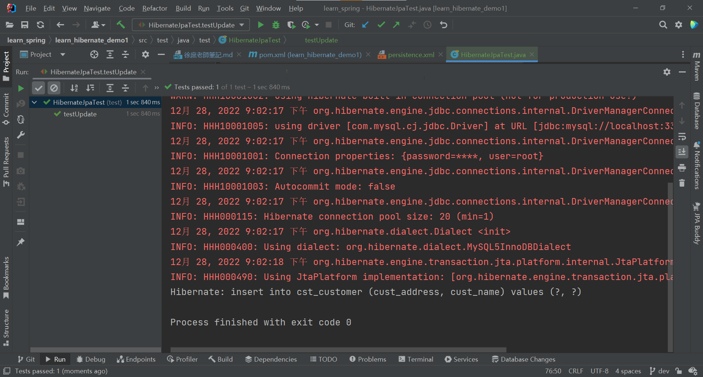

# 徐庶老師 講解Spring Data Jpa


常用模組


Spring Data特性


spring 官網寫的特性


## 什麼是jpa?


## Hibernate 、Mybatis、jpa 的 特性


## 學習Hibernate








HibernateTest.java

```java
package test;

import com.example.entity.Customer;
import org.hibernate.Session;
import org.hibernate.SessionFactory;
import org.hibernate.Transaction;
import org.hibernate.boot.MetadataSources;
import org.hibernate.boot.registry.StandardServiceRegistry;
import org.hibernate.boot.registry.StandardServiceRegistryBuilder;
import org.junit.Before;
import org.junit.Test;

public class HibernateTest {

    //Session工廠  Session:數據庫對話 代碼持久化操作數據的一個橋樑
    //可以理解成mybatis的sql session工廠
    private SessionFactory sf;

    @Before
    public void init() {
        StandardServiceRegistry registry = new StandardServiceRegistryBuilder()
                .configure("/hibernate.cfg.xml")
                .build();

        //根據服務註冊類創建一個元數據資源集，同時構建元數據並生成應用一般唯一的session工廠

        sf = new MetadataSources(registry).buildMetadata().buildSessionFactory();

    }

    @Test
    public void test() {
        //創建session
        Session sess = sf.openSession();
        //開始事務
        Transaction transaction = sess.beginTransaction();
        //創建消息隊列
        Customer customer = new Customer();
        customer.setCustName("張三");

        //保存消息
        sess.save(customer);
        //提交事務
        transaction.commit();
        //關閉session
        sess.close();
        sf.close();

    }

    @Test
    public void testCreate() {
        //session進行持久化操作
        try (Session session = sf.openSession()) {
            Transaction transaction = session.beginTransaction();

            Customer customer = new Customer();
            customer.setCustName("徐庶");

            session.save(customer);

            transaction.commit();


        }


    }

    @Test
    public void testRead() {
        //session進行持久化操作
        try (Session session = sf.openSession()) {
            Transaction transaction = session.beginTransaction();

//            Customer customer = new Customer();
//            customer.setCustName("徐庶");
//
//            session.save(customer);
            Customer customer = session.find(Customer.class, 1L);
//            Customer customer = session.load(Customer.class, 1L);
            System.out.println("====================");
            System.out.println(customer);

            transaction.commit();


        }


    }

    @Test
    public void testRead_lazy() {
        //session進行持久化操作
        try (Session session = sf.openSession()) {
            Transaction transaction = session.beginTransaction();

//            Customer customer = new Customer();
//            customer.setCustName("徐庶");
//
//            session.save(customer);
//            Customer customer = session.find(Customer.class, 1L);
            Customer customer = session.load(Customer.class, 1L);//使用懶加載方式
            System.out.println("====================");
            System.out.println(customer);

            transaction.commit();


        }
    }

    @Test
    public void testUpdate() {
        //session進行持久化操作
        try (Session session = sf.openSession()) {
            Transaction transaction = session.beginTransaction();

            Customer customer = new Customer();
            customer.setCustId(1L);
            customer.setCustName("徐庶");
            //插入session.save();
            //更新session.update();
            session.saveOrUpdate(customer);

            transaction.commit();


        }
    }

    @Test
    public void testDelete() {
        //session進行持久化操作
        try (Session session = sf.openSession()) {
            Transaction transaction = session.beginTransaction();

            Customer customer = new Customer();
            customer.setCustId(2L);
//            customer.setCustName("徐庶");
            //插入session.save();
            //更新session.update();
            session.remove(customer);

            transaction.commit();


        }
    }


}

```
HQL 與 JPQL


練習使用HQL

```java
package test;

import com.example.entity.Customer;
import org.hibernate.Session;
import org.hibernate.SessionFactory;
import org.hibernate.Transaction;
import org.hibernate.boot.MetadataSources;
import org.hibernate.boot.registry.StandardServiceRegistry;
import org.hibernate.boot.registry.StandardServiceRegistryBuilder;
import org.junit.Before;
import org.junit.Test;

import java.util.List;

public class HibernateTest {

    //Session工廠  Session:數據庫對話 代碼持久化操作數據的一個橋樑
    //可以理解成mybatis的sql session工廠
    private SessionFactory sf;

    @Before
    public void init(){
        StandardServiceRegistry registry = new StandardServiceRegistryBuilder()
                .configure("/hibernate.cfg.xml")
                .build() ;

        //根據服務註冊類創建一個元數據資源集，同時構建元數據並生成應用一般唯一的session工廠

        sf = new MetadataSources(registry).buildMetadata().buildSessionFactory();

    }

    @Test
    public void test(){
        //創建session
        Session sess = sf.openSession();
        //開始事務
        Transaction transaction = sess.beginTransaction();
        //創建消息隊列
        Customer customer = new Customer();
        customer.setCustName("張三");

        //保存消息
        sess.save(customer);
        //提交事務
        transaction.commit();
        //關閉session
        sess.close();
        sf.close();

    }
    @Test
    public void testCreate(){
        //session進行持久化操作
        try(Session session = sf.openSession()){
            Transaction transaction = session.beginTransaction();

            Customer customer = new Customer();
            customer.setCustName("徐庶");

            session.save(customer);

            transaction.commit();


        }


    }
    @Test
    public void testRead(){
        //session進行持久化操作
        try(Session session = sf.openSession()){
            Transaction transaction = session.beginTransaction();

//            Customer customer = new Customer();
//            customer.setCustName("徐庶");
//
//            session.save(customer);
            Customer customer = session.find(Customer.class, 1L);
//            Customer customer = session.load(Customer.class, 1L);
            System.out.println("====================");
            System.out.println(customer);

            transaction.commit();


        }


    }
    @Test
    public void testRead_lazy(){
        //session進行持久化操作
        try(Session session = sf.openSession()){
            Transaction transaction = session.beginTransaction();

//            Customer customer = new Customer();
//            customer.setCustName("徐庶");
//
//            session.save(customer);
//            Customer customer = session.find(Customer.class, 1L);
            Customer customer = session.load(Customer.class, 1L);//使用懶加載方式
            System.out.println("====================");
            System.out.println(customer);

            transaction.commit();


        }
    }

    @Test
    public void testUpdate(){
        //session進行持久化操作
        try(Session session = sf.openSession()){
            Transaction transaction = session.beginTransaction();

            Customer customer = new Customer();
            customer.setCustId(1L);
            customer.setCustName("徐庶");
            //插入session.save();
            //更新session.update();
            session.saveOrUpdate(customer);

            transaction.commit();


        }
    }

    @Test
    public void testDelete(){
        //session進行持久化操作
        try(Session session = sf.openSession()){
            Transaction transaction = session.beginTransaction();

            Customer customer = new Customer();
            customer.setCustId(2L);
//            customer.setCustName("徐庶");
            //插入session.save();
            //更新session.update();
            session.remove(customer);

            transaction.commit();


        }
    }
    @Test
    public void testReadByHQL(){
        //session進行持久化操作
        try(Session session = sf.openSession()){
            Transaction transaction = session.beginTransaction();
//            查詢全部
//            String hql = " FROM Customer";
//            List<Customer> resultList = session.createQuery(hql, Customer.class)
//
//                    .getResultList();
            //使用where
            String hql = " FROM Customer where custId=:id";//具名參數


            List<Customer> resultList = session.createQuery(hql, Customer.class)
                    .setParameter("id",1L)
                    .getResultList();

            System.out.println(resultList);

//            Customer customer = new Customer();
//            customer.setCustId(2L);
//            customer.setCustName("徐庶");
            //插入session.save();
            //更新session.update();
//            session.remove(customer);

            transaction.commit();


        }
    }


}

```

## 基於JPA數據庫持久化操作
練習Jpa

新增resources/META-INF/persistence.xml
```xml
<?xml version="1.0" encoding="UTF-8" ?>
<persistence xmlns="http://xmlns.jcp.org/xml/ns/persistence" version="2.1">
    <!--    需要配置persistence-unit節點
            持久化單元:
            name:持久化單元名稱
            transaction-type:事務管理的方式
            JTA:分布試事務管理
            RESOURCE_LOCAL:本地事務管理


    -->


    <persistence-unit name="hibernateJPA" transaction-type="RESOURCE_LOCAL">
        <!--        jpa的實現方式-->
        <provider>org.hibernate.jpa.HibernatePersistenceProvider</provider>
        <!--        需要進行ORM的pojo類-->
        <class>com.example.entity.Customer</class>


        <!--        可選配置:配置jpa實現方的配置訊息-->
        <properties>
            <!--            數據庫信息
                用戶名:javax.persistence.jdbc.user
                密碼:javax.persistence.jdbc.password
                驅動:javax.persistence.jdbc.driver
                數據庫地址:javax.persistence.jdbc.url
            -->
            <property name="javax.persistence.jdbc.user" value="root"/>
            <property name="javax.persistence.jdbc.password" value="088220"/>
            <property name="javax.persistence.jdbc.driver" value="com.mysql.jdbc.Driver"/>
            <property name="javax.persistence.jdbc.url"
                      value="jdbc:mysql://localhost:3306/springdata_jpa?useUnicode=true"/>

            <!--            配置jpa實現方(hibernate)的配置信息
                            顯示sql :false|true
                            自動創建數據庫表: hibernate.hbm2ddl.auto
                            create:程序運行時創建數據庫表(如果有表，先刪除再創建)
                            update:程序運行時創建數據庫表(如果有表，不會創建表)
                            none:不會創建表


            -->
            <property name="hibernate.show_sql" value="true"/>
            <property name="hbm2ddl.auto" value="update"/>
            <property name="hibernate.dialect" value="org.hibernate.dialect.MySQL5InnoDBDialect"/>


        </properties>


    </persistence-unit>
</persistence>
```

使用Jpa操作Hibernate進行增刪查改 test.HibernateJpaTest
```java
package test;

import com.example.entity.Customer;
import org.junit.Before;
import org.junit.Test;

import javax.persistence.EntityManager;
import javax.persistence.EntityManagerFactory;
import javax.persistence.EntityTransaction;
import javax.persistence.Persistence;

public class JPATest {

    EntityManagerFactory entityManagerFactory;

    @Before
    public void before() {
        entityManagerFactory = Persistence.createEntityManagerFactory("hibernateJPA");
    }

    @Test
    public void testCreate(){
        EntityManager entityManager = entityManagerFactory.createEntityManager();
        EntityTransaction transaction = entityManager.getTransaction();
        transaction.begin();

        Customer customer= new Customer();
        customer.setCustName("張三");

        entityManager.persist(customer);
        transaction.commit();


    }

}

```

配置opnejpa META-INF/persistence.xml
```xml
<?xml version="1.0" encoding="UTF-8" ?>
<persistence xmlns="http://xmlns.jcp.org/xml/ns/persistence" version="2.1">
    <!--    需要配置persistence-unit節點
            持久化單元:
            name:持久化單元名稱
            transaction-type:事務管理的方式
            JTA:分布試事務管理
            RESOURCE_LOCAL:本地事務管理


    -->


    <persistence-unit name="hibernateJPA" transaction-type="RESOURCE_LOCAL">
        <!--        jpa的實現方式-->
        <provider>org.hibernate.jpa.HibernatePersistenceProvider</provider>
        <!--        需要進行ORM的pojo類-->
        <class>com.example.entity.Customer</class>


        <!--        可選配置:配置jpa實現方的配置訊息-->
        <properties>
            <!--            數據庫信息
                用戶名:javax.persistence.jdbc.user
                密碼:javax.persistence.jdbc.password
                驅動:javax.persistence.jdbc.driver
                數據庫地址:javax.persistence.jdbc.url
            -->
            <property name="javax.persistence.jdbc.user" value="root"/>
            <property name="javax.persistence.jdbc.password" value="088220"/>
            <property name="javax.persistence.jdbc.driver" value="com.mysql.cj.jdbc.Driver"/>
            <property name="javax.persistence.jdbc.url"
                      value="jdbc:mysql://localhost:3306/springdata_jpa?useUnicode=true"/>

            <!--            配置jpa實現方(hibernate)的配置信息
                            顯示sql :false|true
                            自動創建數據庫表: hibernate.hbm2ddl.auto
                            create:程序運行時創建數據庫表(如果有表，先刪除再創建)
                            update:程序運行時創建數據庫表(如果有表，不會創建表)
                            none:不會創建表


            -->
            <property name="hibernate.show_sql" value="true"/>
            <property name="hbm2ddl.auto" value="update"/>
            <property name="hibernate.dialect" value="org.hibernate.dialect.MySQL5InnoDBDialect"/>


        </properties>


    </persistence-unit>

    <persistence-unit name="openJpa" transaction-type="RESOURCE_LOCAL">
        <!--        jpa的實現方式-->
        <provider>org.apache.openjpa.persistence.PersistenceProviderImpl</provider>
        <!--        需要進行ORM的pojo類-->
        <class>com.example.entity.Customer</class>


        <!--        可選配置:配置jpa實現方的配置訊息-->
        <properties>
            <!--            數據庫信息
                用戶名:javax.persistence.jdbc.user
                密碼:javax.persistence.jdbc.password
                驅動:javax.persistence.jdbc.driver
                數據庫地址:javax.persistence.jdbc.url
            -->
<!--            <property name="javax.persistence.jdbc.user" value="root"/>-->
<!--            <property name="javax.persistence.jdbc.password" value="088220"/>-->
<!--            <property name="javax.persistence.jdbc.driver" value="com.mysql.cj.jdbc.Driver"/>-->
<!--            <property name="javax.persistence.jdbc.url"-->
<!--                      value="jdbc:mysql://localhost:3306/springdata_jpa?useUnicode=true"/>-->
            <property name="openjpa.ConnectionURL" value="jdbc:mysql://localhost:3306/springdata_jpa?useUnicode=true"/>
            <property name="openjpa.ConnectionDriverName" value="com.mysql.cj.jdbc.Driver"/>
            <property name="openjpa.ConnectionUserName" value="root"/>
            <property name="openjpa.ConnectionPassword" value="088220"/>

            <!--            配置jpa實現方(openjpa)的配置信息
                            
            -->
            <!--            可以自動生成數據庫表-->
            <property name="openjpa.jdbc.SynchronizeMappings" value="buildSchema(ForeignKeys=true)"/>
            <!-- 不使用加载时强化和编译时强化，使用运行时Unenhanced -->
            <property name="openjpa.ClassLoadEnhancement" value="false" />
            <property name="openjpa.DynamicEnhancementAgent" value="false" />
            <property name="openjpa.RuntimeUnenhancedClasses" value="supported" />

        </properties>


    </persistence-unit>
</persistence>
```

使用Jpa操作OpneJpa進行增刪查改 test.OpenJpaTest
```java
package test;

import com.example.entity.Customer;
import org.junit.Before;
import org.junit.Test;

import javax.persistence.EntityManager;
import javax.persistence.EntityManagerFactory;
import javax.persistence.EntityTransaction;
import javax.persistence.Persistence;

public class OpenJpaTest {

    EntityManagerFactory entityManagerFactory;

    @Before
    public void before() {
        entityManagerFactory = Persistence.createEntityManagerFactory("openJpa");
    }

    @Test
    public void testCreate(){
        EntityManager entityManager = entityManagerFactory.createEntityManager();
        EntityTransaction transaction = entityManager.getTransaction();
        transaction.begin();

        Customer customer= new Customer();
        customer.setCustName("張三");

        entityManager.persist(customer);


        transaction.commit();
    }
    @Test
    public void testRead(){
        EntityManager entityManager = entityManagerFactory.createEntityManager();
        EntityTransaction transaction = entityManager.getTransaction();
        transaction.begin();

//        Customer customer= new Customer();
//        customer.setCustName("張三");
//        entityManager.persist(customer);

        Customer customer = entityManager.find(Customer.class,1L);
        System.out.println("============================");
        System.out.println(customer);


        transaction.commit();
    }
}

```

使用Jpa操作Hibernate進行增刪查改 test.HibernateJpaTest


```java

```


