# Spring 筆記 狂神說

TODO : 補上6.2前面

## 6.2

### 1.複雜類型

```java
public class Address {

    private String address;

    public String getAddress() {
        return address;
    }

    public void setAddress(String address) {
        this.address = address;
    }

}
```

### 2.真實測試對象

```java
public class Student {

    private String name;
    private Address address;
    private String[] books;
    private List<String> hobbys;
    private Map<String,String> card;
    private Set<String> games;
    private Properties info;
    private String wife;
}
```

### 3.beans.xml

```xml
<?xml version="1.0" encoding="UTF-8"?>
<beans xmlns="http://www.springframework.org/schema/beans"
       xmlns:xsi="http://www.w3.org/2001/XMLSchema-instance"
       xsi:schemaLocation="http://www.springframework.org/schema/beans http://www.springframework.org/schema/beans/spring-beans.xsd">

    <import resource="beans.xml"></import>

</beans>
```

### 4.測試類

```java
public class MyTest1 {

    public static void main(String[] args) {
        ApplicationContext context = new ClassPathXmlApplicationContext("applicationContext.xml");

        Student student = (Student) context.getBean("student");

        System.out.println(student.getName());

    }
}
```

### 完善注入訊息

```java
Student{name='danny',
         address=Address{address='null'},
         books=[紅樓夢, 西遊記, 三國演義],
         hobbys=[聽歌, 敲代碼, 看電影],
         card={身分證=11111, 銀行卡=22222},
         games=[LOL, COC, BOB],
         info={性別=男, 學號=111111},
         wife='null'}
```

## 6.3、拓展方式注入

我們可以使用p命名空間和c命名空間進行注入

官方解釋：


使用!

```xml
<?xml version="1.0" encoding="UTF-8"?>
<beans xmlns="http://www.springframework.org/schema/beans"
       xmlns:xsi="http://www.w3.org/2001/XMLSchema-instance"
       xmlns:p="http://www.springframework.org/schema/p"
       xmlns:c="http://www.springframework.org/schema/c"
       xsi:schemaLocation="http://www.springframework.org/schema/beans http://www.springframework.org/schema/beans/spring-beans.xsd">

<!--    p命名空間注入 p -> property ，可以直接注入屬性的值-->
<!--    <bean id="user" class="danny.pojo.User" p:name="danny" p:age="18"/>-->
    <!--   c命名空間注入 c -> construct-args ，通過構造函數注入-->
    <bean id="user2" class="danny.pojo.User" c:age='18' c:name="狂神" />

</beans>
```

測試：

```java
@Test
    public void test(){
        ApplicationContext context = new ClassPathXmlApplicationContext("applicationContext.xml");
        User user = context.getBean("user2", User.class);

        System.out.println(user);
    }
```

注意點：p命名和c命名不能直接使用，需導入xml約束

```xml
xmlns:p="http://www.springframework.org/schema/p"
xmlns:c="http://www.springframework.org/schema/c"
```

## 6.4、bean的作用域


### 1.單例模式(預設)

```xml
<bean id="user2" class="danny.pojo.User" c:age='18' c:name="狂神" scope="singleton"/>
```

### 2. 原型(prototype)模式 : 每次從容器中get的時候，都會產生一個新物件

```xml
<bean id="accountService" class="com.something.DefaultAccountService" scope="prototype"/>
```

### 3.其餘的request、session、application 這些只能在web開發中使用到!

## 7、bean 的自動裝配

- 自動裝配是Spring滿足bean依賴的一種方式！
- Spring 會在上下文自動尋找，並自動給bean裝配屬性

在Spring中有三種裝配的方式

1. 在xml中顯示的配置
2. 在java中顯示配置
3. 隱式的自動裝配bean【 重要  】

## 7.1 、 測試

1.環境搭建 : 一個人有兩個寵物

## 7.2 ByName自動裝配

```xml
<!--
    byName : 會自動在容器中上下文查找，和自己對象set方法後面的值對應的bean id
-->
    <bean id="people" class="danny.People" autowire="byName">
        <property name="name" value="小黃"/>
```

### 7.3 ByType

```xml
<bean id="cat" class="danny.Cat"/>
    <bean id="dog" class="danny.Dog"/>
    
<!--
    byName : 會自動在容器中上下文查找，和自己對象set方法後面的值對應的bean id
    byType : 會自動在容器中上下文查找，和自己對象屬性類型相同的 bean
-->
    <bean id="people" class="danny.People" autowire="byType">
        <property name="name" value="小黃"/>

    </bean>
```

小結 : 

- byname的時候，需要保證所有bean的id唯一，並且這個bean需要和自動注入的屬性的方法一致
- bytype的時候，需要保證所有bean的class唯一，並且這個bean需要和自動注入的屬性的類型一致

## 7.4 使用註解實現自動裝配

jdk1.5支持的註解，Spring2.5就支持註解

The introduction of annotation-based configuration raised the question of whether this approach is “better” than XML.

要使用註解須知 :

1. 導入約束 context約束
2. 配置註解的支持  ***<context:annotation-config/> 【重要】***

```xml
<?xml version="1.0" encoding="UTF-8"?>
<beans xmlns="http://www.springframework.org/schema/beans"
    xmlns:xsi="http://www.w3.org/2001/XMLSchema-instance"
    xmlns:context="http://www.springframework.org/schema/context"
    xsi:schemaLocation="http://www.springframework.org/schema/beans
        https://www.springframework.org/schema/beans/spring-beans.xsd
        http://www.springframework.org/schema/context
        https://www.springframework.org/schema/context/spring-context.xsd">

    <context:annotation-config/>

</beans>
```

@Autowired

直接在屬性上使用即可，也可以在setter上使用

使用AutoWired 我們可以不用編寫Set方法了，前提是你這個自動裝配的屬性在IOC容器中存在且符合名字byname

科普 :

```xml
@Nullable  字段標記了這個註解，說明這個字段可以為null
```

```java
public @interface Autowired {
    boolean required() default true;
}
```

測試代碼 :

```java
public class People {
    //如果顯示定義了Autowired的required屬性為false，說明這個屬性可以為null，否則不允許為null
    @Autowired(required = false)
    private Cat cat;
    @Autowired
    private Dog dog;
    private String name;
}
```

如果@Autowired 自動裝配的環境比較複雜，自動裝配無法通過一個註解【@Autowired】完成的時候，我們可以使用`@Qualifier(value = **"xxx"**)` 去配置@Autowired的使用，指定一個唯一的bean對象注入

```java
public class People {
    
    @Autowired
    @Qualifier(value = "cat11")
    private Cat cat;
    @Autowired
    @Qualifier(value = "dog222")
    private Dog dog;
}
```

@Resource註解  也可以自動裝配

```java
public class People {

    @Resource
    private Cat cat;
    @Resource
    private Dog dog;
    private String name;
}
```

```java
public class People {

    @Resource(name = "cat2")
    private Cat cat;
    @Resource
    private Dog dog;
    private String name;
}
```

小結 : @Resource和@Autowired的區別 :

- 都是用來自動裝配的，都可以放在屬性字段上
- @Autowired  通過byType方式實現，而且必須要求這個對象存在!【常用】
- @Resource預設通過byName方式實現，如果找不到名字，則通過byType實現，如果兩個都找不到的情況下，就報錯 【常用】
- 執行順序不同 :`@Autowired通過byType的方式實現，@Resource預設通過byName的方式實現`

# 8.使用註解開發

- 在Spring4之後，要使用註解開發，需要保證aop的包導入了
- 使用註解需要導入context約束，增加註解的支持
    - @Component : 組件，放在類上，說明這個類被Spring管理了，就是bean
1. bean
2. 屬性如何注入

```java
//等價於<bean id="user" class="danny.pojo.User"/>
//@Component 組件

@Component
public class User {
    public String name = "danny";
}
```

在屬性上注入

```java
//等價於<bean id="user" class="danny.pojo.User"/>
//@Component 組件

@Component
public class User {
//相當於 <property name="name" value="danny"/>-->
    @Value("danny")
    public String name;
}
```

在setter上注入

```java
@Component
public classUser {

publicStringname;

publicString getName() {
returnname;
    }
//相當於 <property name="name" value="danny"/>-->
@Value("danny")
public voidsetName(String name) {
this.name= name;
    }
}
```

1. 衍生的註解

@Component 有幾個衍生註解，我們在web開發中，會按照mvc三層架構分層

- dao【@Repository】
- service【@Service】
- controller【@Controller】

這四個註解功能都是一樣的，都是代表將某個類註冊到Spring中，裝配Bean

1. 自動裝配配置
    
    ```markdown
    ###註解說明
    -@Autowired : 自動裝配通過類型，名字
    如果@Autowired 不能偎依自動裝配上屬性，則需要通過@Qualifier(value = "xxx")
    
    -@Resource : 自動裝配先通過名字，類型
    -@Nullable  字段標記了這個註解，說明這個字段可以為null
    ```
    

5. 作用域

```java
@Component
@Scope("singleton")
public class User {
    public String name;
    public String getName() {
        return name;
    }
    //相當於 <property name="name" value="danny"/>-->
    @Value("danny")
    public void setName(String name) {
        this.name = name;
    }
}
```

1. 小結

xml 與註解 :

- xml更加萬能，適用於任何場合，維護簡單方便
- 註解不是自己類使用不了，維護相對複雜

最佳實踐 :

- xml用來管理bean
- 註解只負責完成屬性的注入
- 我們在使用的過程中，只需要注意一個問題：必須讓註解生效，就需要開啟註解支持

```xml
<!--開啟註解的支持-->
    <context:annotation-config/>
<!--  指定要掃描的包，這個包下的註解就會生效  -->
    <context:component-scan base-package="danny"/>
```

# 9.使用java的方式配置Spring

我們現在要完全不使用Spring的xml配置了，全權交給java來做!

JavaConfig是Spring的一個子項目，在Spring4之後，它成為了核心功能

配置文件

```java
//這個也會被Spring容器託管，註冊到容器中，因為他本來就是一個@Component，
// @Configuration代表這是一個配置類，就和我們之前看的beans.xml一樣
@Configuration
@ComponentScan("danny")
public class MyConfig {

    //註冊一個bean，就相當於我們之前寫的一個bean標籤
    //這個方法的名字，就相當於bean標籤中的id屬性
    //這個方法的返回值，就相當於bean標籤中的class屬性
    @Bean
    public User getUser(){
        return new User();//就是返回要注入到bean的對象
    }
}
```

```java
//這裡這個註解的意思，就是說明這個類被Spring接管了，註冊到了容器中
@Component
public class User {
    private String name;

    public String getName() {
        return name;
    }

    @Value("Danny") // 屬性注入值
    public void setName(String name) {
        this.name = name;
    }

    @Override
    public String toString() {
        return "User{" +
                "name='" + name + '\'' +
                '}';
    }
}
```

測試類

```java
public class MyTest {
    public static void main(String[] args) {

        //如果完全使用了配置類方式去做，我們就只能通過 AnnotationConfig上下文來獲取容器，通過配置類的class對象加載。
        ApplicationContext context = new AnnotationConfigApplicationContext(MyConfig.class);
        User user = context.getBean("getUser", User.class);
        System.out.println(user.getName());

    }
}
```

這種純java的配置方式，在Springboot中隨處可見

# 10. 代理模式 (AOP面向切面編成的基礎)

為什麼要學習代理模式? 因為這就是Spring AOP的底層 【SpringAOP和SpringMVC】

代理模式的分類 :

- 靜態代理
- 動態代理

## 10.1 靜態代理

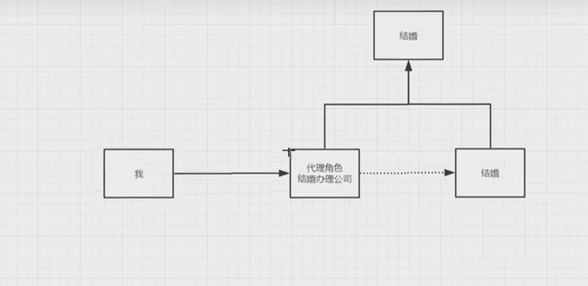
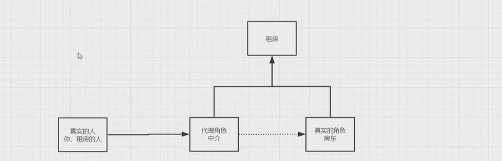

角色分析 :

- 抽象角色：一般會使用接口或抽象類來解決
- 真實角色：被代理的角色
- 代理角色：代理真實的角色，代理真實角色後，我們一般會做一些附屬操作
- 客戶：訪問代理對象的人

代碼步驟：

1.接口

```java
public interface Rent {
    void rent();
}
```

2.真實角色

```java
//房東
public class Host implements Rent{
    @Override
    public void rent() {
        System.out.println("房東要出租房子啦!");
    }
}
```

3.代理角色

```java
public class Proxy implements Rent{

    private Host host;

    public Proxy() {
    }

    public Proxy(Host host) {
        this.host = host;
    }

    @Override
    public void rent() {
        seeHouse();
        host.rent();
        hetong();
        fare();
    }

    //看房
    public void seeHouse(){
        System.out.println("仲介帶你看房");
    }

    //收仲介費
    public void fare(){
        System.out.println("收仲介費");
    }
    //簽合約
    public void hetong(){
        System.out.println("簽合約");
    }

}
```

4.客戶端訪問代理角色

```java
public class Client {
    public static void main(String[] args) {
//        Host host=new Host();
//        host.rent();
//無法直接租房，要透過仲介

        //房東要租房子
        Host host = new Host();
        //代理，中介幫房東租房子，但是呢，代理一般會有一些附屬操作
        Proxy proxy = new Proxy(host);

        //你不用找房東，直接找仲介即可
        proxy.rent();
    }
}
```

代理模式的好處 :

- 可以使真實角色的操作更加純粹，不用去關注一些公共的業務
- 公共業務也就交給代理角色，實現的業務的分工
- 公共業務發生擴展的時候，方便集中管理

代理模式的缺點 :

- 一個真實角色就會產生一個代理角色，代碼量會翻倍~開發效率會變低~

### 10.2 加深理解

聊聊AOP

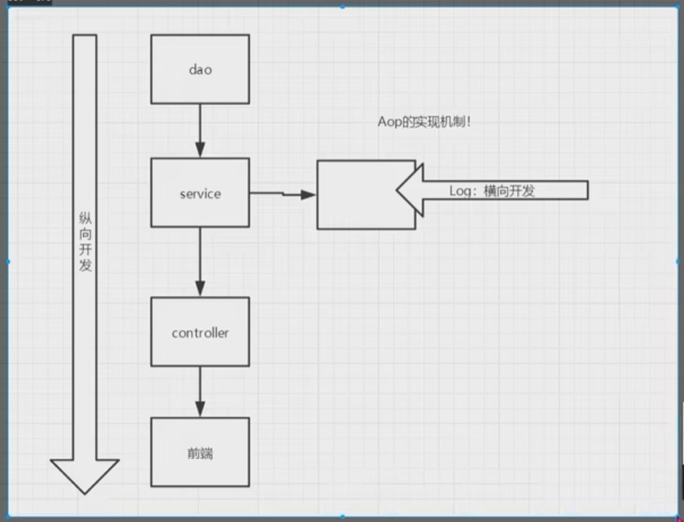 

## 10.3 動態代理

- 動態代理和靜態代理角色一樣
- 動態代理的代理類是動態生成的，不是我們直接寫好的!
- 動態代理分為兩大類
    - 基於接口的動態代理 --JDK動態代理
    - 基於類的動態代理  --cglib
    - java字節碼實現 : javassist

需要了解兩個類： Proxy : 代理, InvocationHandler : 調用代理程序

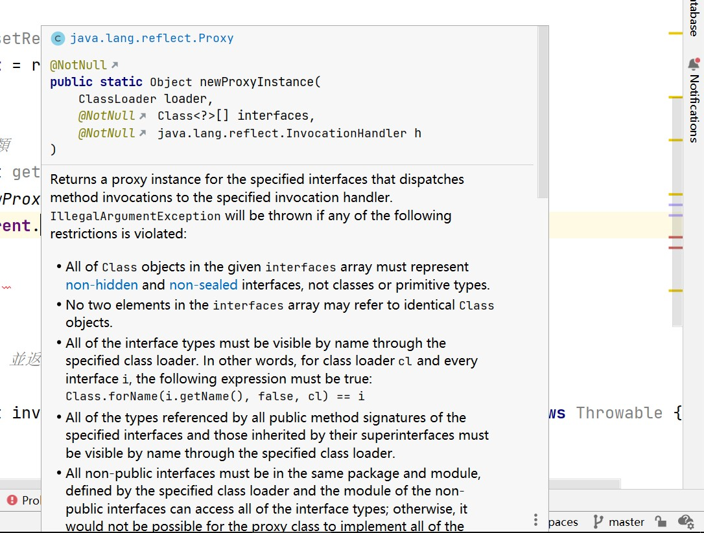

動態代理的好處 :
- 可以使真實角色的操作更加純粹，不用去關注一些公共的業務
- 公共業務也就交給代理角色，實現的業務的分工
- 公共業務發生擴展的時候，方便集中管理
- 一個動態代理類代理的是一個接口，一般就是對應的一類事務
- 一個動態代理類可以代理多個類，只要是實現了同一個接口即可

# 11. AOP

## 11.1 什麼是AOP

AOP(aspect Oriented Programing)意為:面向切面編程，//TODO
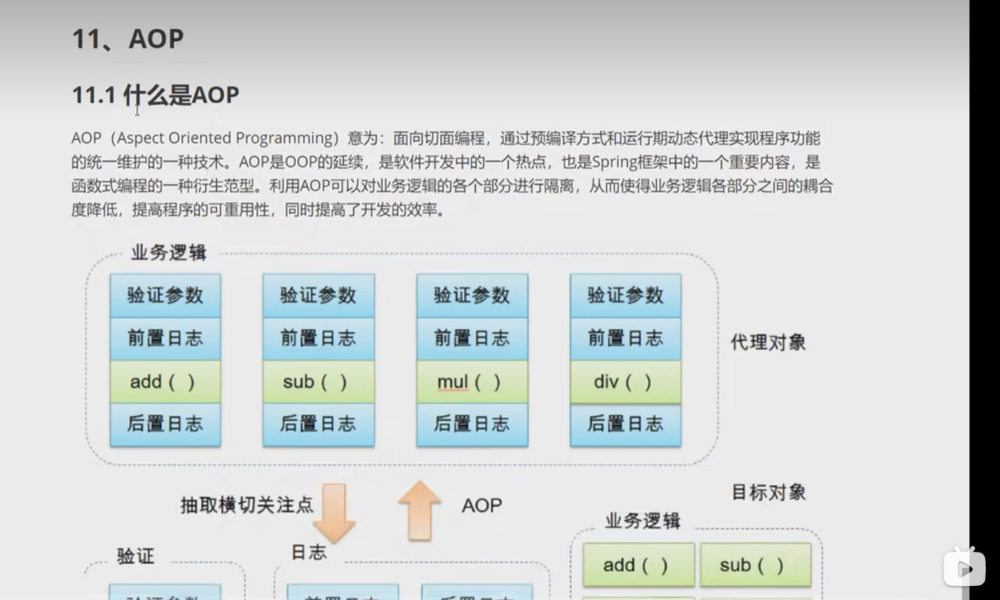

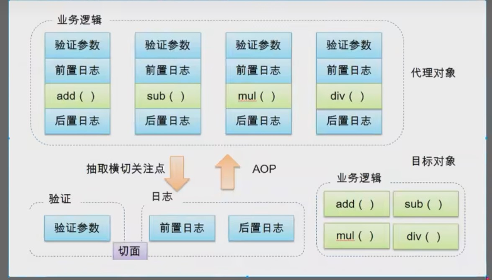
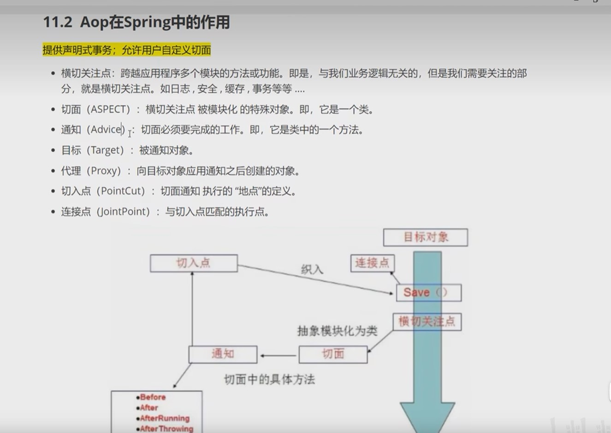

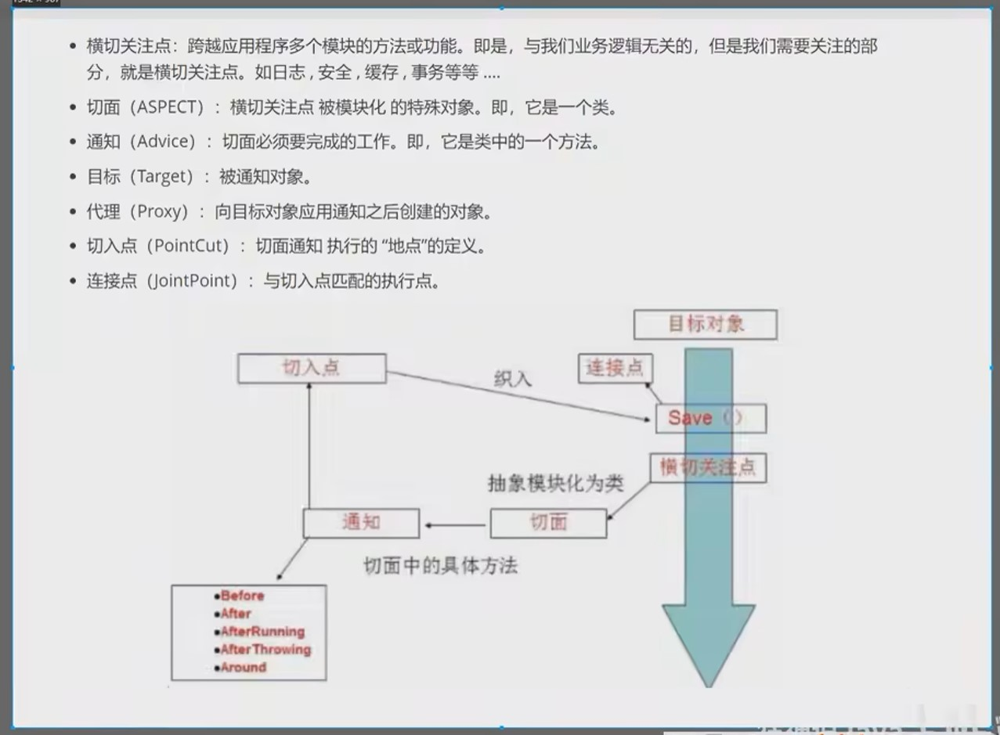
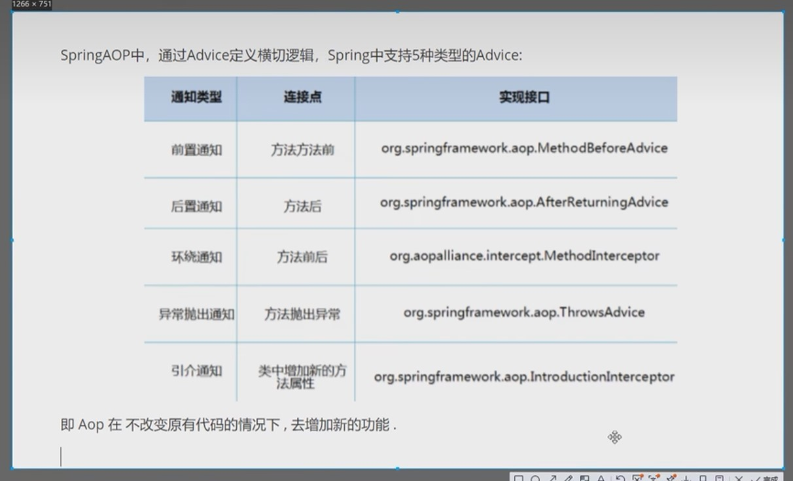
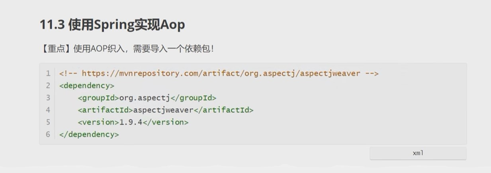

# 11.3 使用Spring實現AOP

方式一 : 使用Spring的API接口【主要Spring API接口實現】

方式二 : 自定義來實現AOP【主要是切面定義】

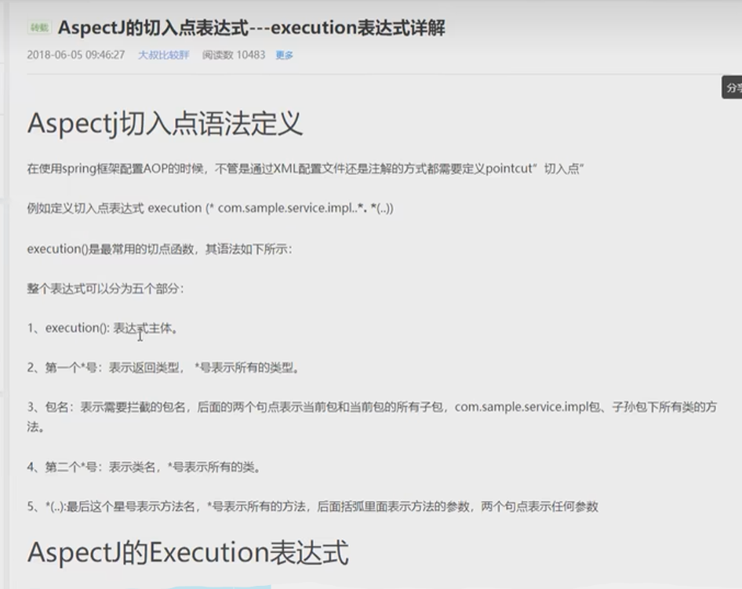

方式三 : 使用註解實現

注意導入的包
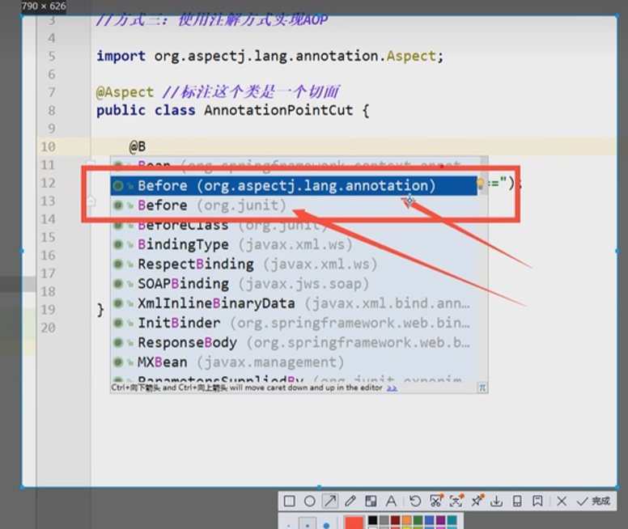

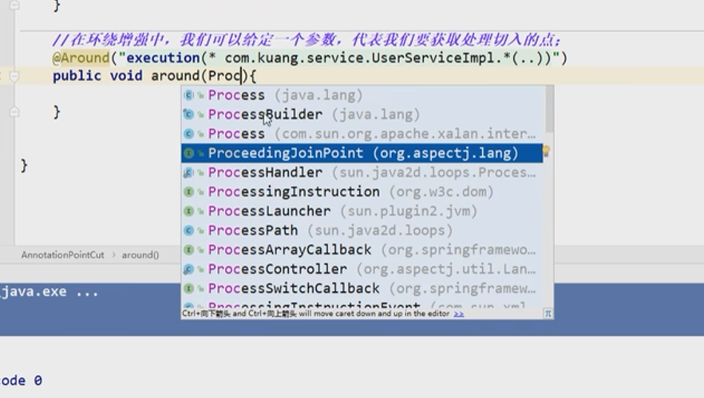


